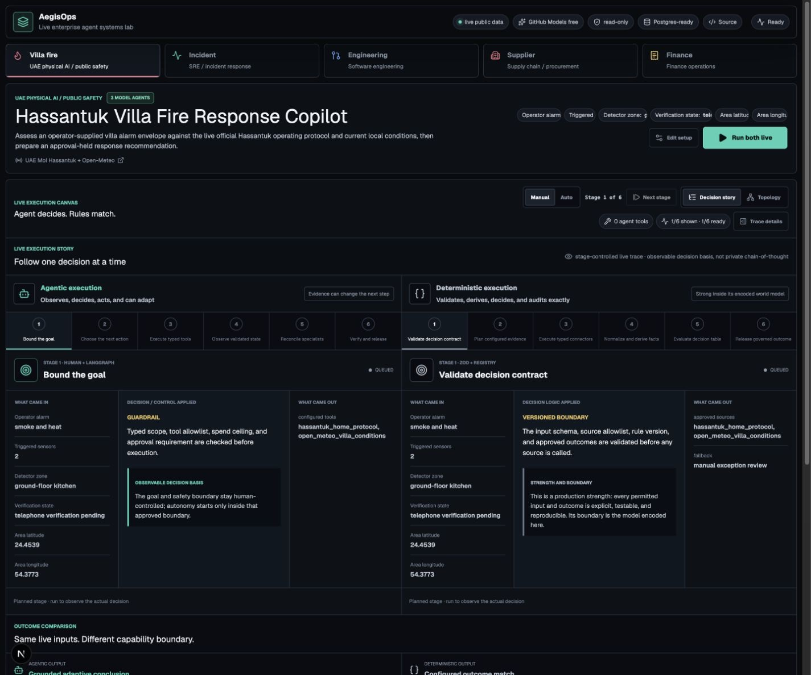
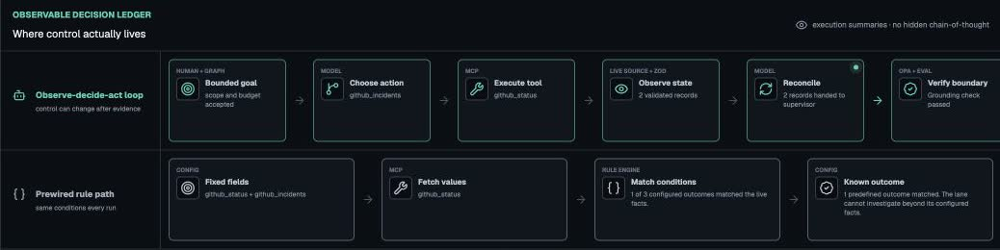
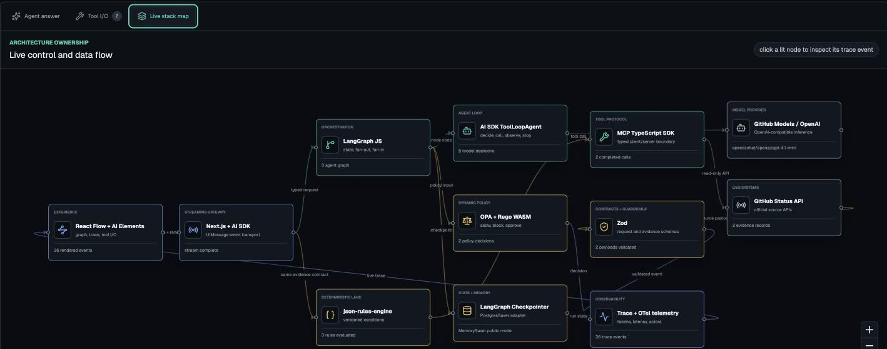
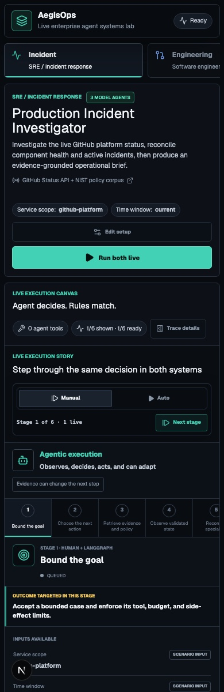
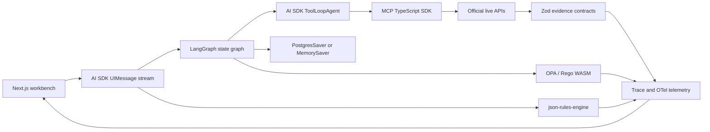

# AegisOps

### A live enterprise agent systems lab

[](https://aegisops-agentic-portfolio.vercel.app)
[](https://github.com/ajaycyril/aegisops-agentic-portfolio/actions)
[](https://github.com/ajaycyril/aegisops-agentic-portfolio/security/code-scanning)
[](./LICENSE)
[](./docs/architecture/05-live-workbench-runtime.md)

**AegisOps runs agentic and deterministic systems side by side against the same live evidence.**
It makes the control boundary visible: what the graph constrains, what the model chooses, which
typed tools execute, what evidence returns, where policy intervenes, and why a fixed rule engine
cannot perform the same adaptive work.

[Open the production workbench](https://aegisops-agentic-portfolio.vercel.app) ·
[Read the user guide](./docs/USER_GUIDE.md) ·
[Explore the enterprise playbook](./docs/ENTERPRISE_AGENTIC_PLAYBOOK.md)



## The Question This Project Answers

Enterprises do not need an agent for every workflow. They need a defensible way to decide where
agentic control adds value and where deterministic automation remains safer, cheaper, and clearer.

| Control mode         | Best fit                                                                  | What is visible in AegisOps                                                |
| -------------------- | ------------------------------------------------------------------------- | -------------------------------------------------------------------------- |
| Deterministic system | Stable facts, typed derivations, decision tables, known routes            | Inputs, derived facts, matched outcomes, exception path, zero model cost   |
| Dynamic policy       | Contextual allow, block, and approval decisions                           | OPA/Rego input, decision, controls, approval requirement                   |
| AI workflow          | Bounded generation or evaluation inside a fixed graph                     | Model, prompt boundary, structured output, tokens, eval result             |
| Agentic              | Evidence changes the next action, tool choice, handoff, or stopping point | LangGraph state, model decision, MCP call, observation, adaptation, policy |

The product does not expose or fabricate private model chain-of-thought. It exposes the operational
decisions required to audit the system: available and selected tools, graph constraints, agent role,
evidence, handoffs, finish reason, policy state, cost, latency, and trace identity.

The default **Decision story** is designed for a non-technical reader. Every stage shows the actual
input, who or what controls the step, the observable decision or fixed condition, and the resulting
output. A plain-language line explains why the step is adaptive in the agentic lane or preconfigured
in the deterministic lane. The final model conclusion and matched rule outcome are compared in the
same surface; the full React Flow topology remains available as an architect lens.

The runtime is not artificially slowed. AegisOps buffers only events that the live runtime has
already emitted, then presents them on a readable clock with a received-versus-presented counter.
One animated stage per lane stays in focus while a compact progress rail allows manual review. The
trace inspector, raw payloads, stack map, tuning controls, and editable inputs remain available
through progressive disclosure instead of competing with the primary explanation.



## What Runs Today

Press **Run both live** and two concurrent lanes execute against the same official public source:

1. A LangGraph and AI SDK agentic lane selects typed MCP tools, observes validated evidence,
   adapts or reconciles, passes OPA policy, and completes a grounding evaluation.
2. A `json-rules-engine` lane fetches predefined fields and can return only outcomes configured
   before the run.

Four interactive workflows are deployed:

| Workflow                         | Live evidence      | Enterprise integration pattern                   | Why agentic                                                           |
| -------------------------------- | ------------------ | ------------------------------------------------ | --------------------------------------------------------------------- |
| Production Incident Investigator | GitHub Status API  | Datadog, PagerDuty, deployment telemetry, GitHub | Parallel specialists reconcile independent operational evidence       |
| Engineering Issue Triage         | GitHub REST API    | GitHub Enterprise, Jira, CI/CD, code search      | Investigation changes as issue and repository context arrive          |
| Supplier Entity Risk             | GLEIF LEI API      | ERP supplier master, sanctions, procurement      | Entity ambiguity and incomplete evidence require explainable research |
| Finance Evidence Analyst         | SEC EDGAR Data API | ERP subledger, filings, policy, approvals        | Filing periods and caveats must be grounded before judgment           |

The repository also contains production contracts for customer support, security remediation,
invoice exceptions, compliance evidence, sales/RFP, BI analysis, and HR/IT access workflows.

## Live Architecture

The architecture view is generated from the same streamed run events as the workflow graph. A
layer lights up only when its runtime evidence exists.



On mobile, decision stages become full-width vertical cards so inputs, controls, outputs, and the
agentic value remain readable. The technical topology stays interactive and pannable rather than
being reduced to a static illustration.





### Stack

| Layer                   | Production choice                                                            |
| ----------------------- | ---------------------------------------------------------------------------- |
| Experience              | Next.js 16, React 19, AI Elements, React Flow 12                             |
| Agent orchestration     | LangGraph JS 1.4 with fan-out, fan-in, checkpoints, evaluators               |
| Model/tool loop         | Vercel AI SDK 6 `ToolLoopAgent`; OpenAI-compatible provider adapters         |
| Tool boundary           | MCP TypeScript SDK with Zod input and result contracts                       |
| Deterministic decisions | `json-rules-engine` 7                                                        |
| Dynamic authorization   | OPA/Rego compiled to WASM                                                    |
| State and memory        | Postgres/pgvector architecture; LangGraph `PostgresSaver` adapter            |
| Observability           | Typed run events, trace IDs, model/tool telemetry, token and cost accounting |
| Full API                | FastAPI, Pydantic, SQLAlchemy, Alembic, approval and audit records           |
| Deployment              | Vercel Services with a bounded public runtime and read-only registry API     |

## Multi-Agent Work That Is Justified

The incident workflow uses three model agents because the topology matches the operational problem:

- A platform-health specialist reads component state.
- An incident specialist reads unresolved incident evidence.
- LangGraph runs both specialists in parallel and waits at a fan-in barrier.
- A tool-less supervisor reconciles the handoffs without silently collecting new evidence.
- OPA holds side effects, and a grounding evaluator requires both sources before completion.

This is not multiple agents for visual effect. Independent evidence collection reduces blind spots;
the supervisor exists because the reports may need conflict resolution and one accountable output.

## Public Runtime Safety

The public deployment is narrower than the enterprise runtime by design:

- Read-only, allowlisted MCP tools only.
- Server-side model allowlist.
- Mandatory approval semantics for side effects.
- OPA/Rego policy outside the model.
- Typed request, tool, evidence, event, and policy contracts.
- Request-size, rate, concurrency, tool-count, token, spend, and duration bounds.
- No browser credentials and no committed secrets.
- Security headers and no-store streaming responses.
- CodeQL, Dependabot, CI, policy tests, and contract tests.

The free public deployment uses `MemorySaver` and an in-process limiter when managed state is not
configured. An enterprise deployment must activate Postgres checkpoints, shared Redis-compatible
rate limiting, authenticated connectors, durable approval/audit records, and identity-aware policy
before enabling writes.

See [SECURITY.md](./SECURITY.md) for disclosure and deployment boundaries.

## Run Locally

Prerequisites: Node.js 24 and pnpm 10.15.1.

```bash
pnpm install --frozen-lockfile
cp .env.example .env.local
pnpm --filter @aegisops/web dev
```

Open `http://localhost:3000`. A provider credential is required for model-backed runs; health,
documentation, contracts, rules, and most tests do not require one. Never expose a provider key as
a `NEXT_PUBLIC_*` variable.

Validation:

```bash
pnpm --filter @aegisops/web lint
pnpm --filter @aegisops/web typecheck
pnpm --filter @aegisops/web test
pnpm --filter @aegisops/web build
node scripts/check-docs-placeholders.mjs
```

Full setup details: [Local development](./docs/development/local-setup.md) and
[production runbook](./docs/deployment/production-runbook.md).

## Repository Map

```text
apps/web/                  live workbench and bounded public agent runtime
services/api/              stateful FastAPI enterprise runtime
services/api-vercel/       read-only public registry API
configs/workflows/         enterprise workflow contracts
configs/tools/             typed tool registry
configs/connectors/        connector identity and scope contracts
policies/                  OPA/Rego governance
mcp/                       MCP server and tool-boundary design
docs/                      architecture, operations, use cases, and runbooks
```

## Documentation

- [User guide](./docs/USER_GUIDE.md): run and inspect the live workbench.
- [Enterprise agentic playbook](./docs/ENTERPRISE_AGENTIC_PLAYBOOK.md): determine when agentic
  control is justified and how to productionize it.
- [System architecture](./docs/architecture/01-system-architecture.md): runtime and trust boundaries.
- [Stack decisions](./docs/architecture/02-stack-decisions.md): library choices and tradeoffs.
- [Workflow taxonomy](./docs/architecture/03-agentic-workflow-taxonomy.md): deterministic through
  multi-agent patterns.
- [Live runtime](./docs/architecture/05-live-workbench-runtime.md): the deployed execution contract.
- [Use-case portfolio](./docs/use-cases/README.md): ten enterprise workflow families.
- [Project plan](./PROJECT_PLAN.md): durable implementation status and next work.
- [Contributing](./CONTRIBUTING.md): engineering and validation requirements.

## Project Status

The dual-lane live workbench, five public-source workflows, multi-agent incident and UAE villa-fire graphs, typed MCP
tools, OPA policy, grounding checks, observable decision ledger, unit economics, and live stack map
are production deployed. Managed shared state and authenticated enterprise write connectors remain
explicit deployment upgrades, not hidden claims.

## Author

Designed and built by [Ajay Cyril](https://github.com/ajaycyril) as an opinionated reference
implementation for transparent, governed enterprise agent systems: agentic where adaptation creates
measurable value, deterministic where certainty is the better engineering choice.

## License

[MIT](./LICENSE) © 2026 Ajay Cyril
