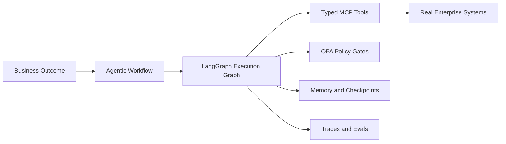

# Executive Overview

AegisOps is a visual-first agentic workflow platform for enterprise operations.

It is designed to show breadth across business functions and depth across the agentic
engineering stack.

## Positioning

AegisOps demonstrates that production agentic AI is not a chatbot. It is a governed execution
system with:

- Deterministic rules.
- Dynamic policy.
- Agentic orchestration.
- Real tools.
- Memory.
- Retrieval.
- Guardrails.
- Human approval.
- Observability.
- Evaluation.
- Cost governance.
- Deployment discipline.

## Audience Layers

| Audience | What They Understand |
| --- | --- |
| CEO | What happened, what was decided, what risk was controlled, and what value was created |
| CTO | How workflows are governed, observed, and safely deployed |
| Engineer | Graph nodes, tool schemas, policy decisions, traces, tests, and deployment contracts |

## Product Promise

The product lets a viewer pick a real enterprise workflow, run or inspect it, and peel every
layer from business outcome down to implementation architecture.

## Initial Build Strategy

Build the platform skeleton and three flagship workflows first:

1. Engineering Issue-to-PR Agent.
2. Customer Support Escalation Agent.
3. Production Incident Investigator.

The remaining workflows remain visible as configured modules until their connectors are added.

## Demo Integrity

Every workflow must use real data from authorized systems. A public demo can replay captured
real runs, but replay must be labeled. Synthetic business data is not acceptable for this
portfolio.
