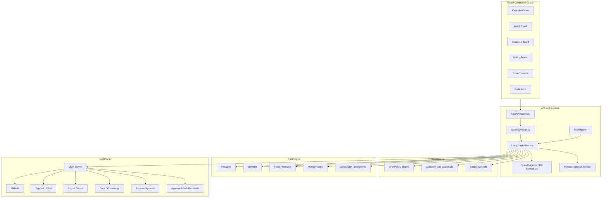
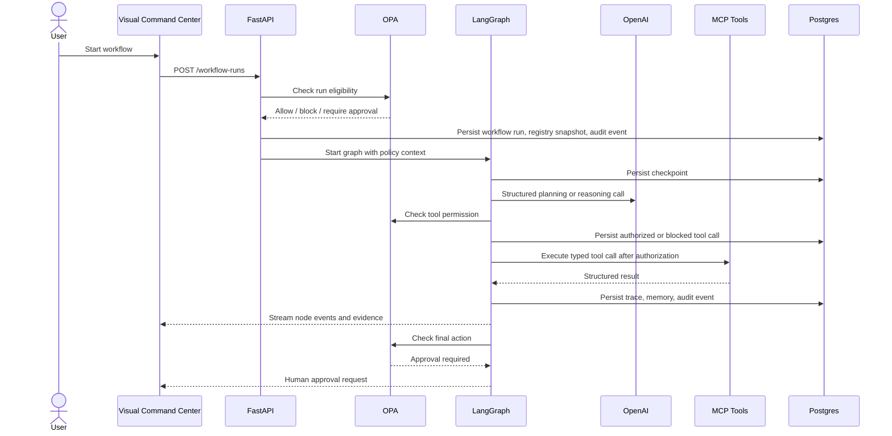

# System Architecture

## High-Level Architecture

## Runtime Flow

## Primary Boundaries

| Boundary | Responsibility |
| --- | --- |
| Web app | Visualization, workflow control, approvals, inspection |
| API gateway | Auth, rate limits, workflow control, streaming |
| Public registry API | Vercel read-only workflow, connector, and tool contract endpoints |
| LangGraph runtime | Stateful orchestration and durable graph execution |
| OpenAI layer | Model calls, structured outputs, specialist managed agents |
| MCP layer | Tool contracts and external system access |
| OPA layer | Dynamic policy decisions outside the model |
| Postgres | App state, audit, memory, checkpoints, retrieval |
| Observability | Traces, evals, model/tool telemetry, cost accounting |

## Public Deployment Split

The public Vercel deployment serves three bounded surfaces:

- `apps/web`: the visual command center.
- `apps/web/app/api/agent-runs`: a Node.js streaming runtime for read-only public-source
  workflows. It enforces typed input, OPA policy, tool and spend ceilings, per-session rate
  limits, and no external writes.
- `services/api-vercel`: a slim read-only FastAPI service mounted at `/api` that exposes
  workflow, connector, and tool registry contracts.

The browser's live demo route is deliberately narrower than the full enterprise runtime. It can
read only the approved public MCP tools and cannot mutate memory or external systems. The full
stateful runtime remains in `services/api` for authenticated enterprise connectors, durable audit,
approval records, and writes. `DATABASE_URL` upgrades the public LangGraph checkpointer from
`MemorySaver` to `PostgresSaver`; a durable Redis-compatible limiter is still required before
raising public traffic limits.

## Production Constraints

- All tool calls must be typed.
- All write actions must be policy-checked.
- Sensitive write actions must require human approval by default.
- All model calls must record model, prompt version, cost estimate, latency, and trace ID.
- All retrieval results must carry source metadata.
- All long-running workflows must checkpoint state.
- All workflow runs must be replayable from trace records.
