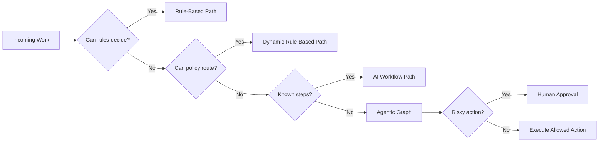

# Agentic Workflow Taxonomy

The platform must distinguish workflow types clearly.

## Control Modes

| Mode | Definition | Example |
| --- | --- | --- |
| Rule-based | Deterministic app logic | SLA timer, required field check, severity threshold |
| Dynamic rule-based | Policy changes without redeploy | OPA rule for approval threshold |
| AI workflow | Fixed sequence using model at specific steps | Extract, summarize, classify, draft |
| Agentic workflow | Model chooses path/tools and iterates under policy | Incident investigation or PR generation |

## Production Agentic Patterns

| Pattern | Description | Portfolio Use |
| --- | --- | --- |
| Routing | Classify and route work to specialist path | Support, security, finance |
| Prompt chaining | Fixed model steps with typed intermediate outputs | RFP, support, compliance |
| Parallel investigation | Independent agents gather evidence concurrently | Incident response, supply chain |
| Orchestrator-worker | Supervisor decomposes work and assigns workers | Issue-to-PR, support, incident |
| Evaluator-optimizer | Critique and improve an answer or plan | Support response, RFP, PR summary |
| ReAct/tool loop | Reason, act with tools, observe, repeat | Incident response, research |
| Plan-and-execute | Create explicit plan and execute steps | Engineering and security remediation |
| RAG agent | Retrieve, cite, and reason over knowledge | Support, compliance, sales |
| Human-in-the-loop | Pause and resume around risky actions | All write workflows |
| Memory workflow | Use thread and long-term memory responsibly | Customer support, HR, sales |
| Data analysis agent | Query real databases with guarded tools | BI and finance |
| Web research agent | Source-grounded research with citations | Supply chain and sales |

## Design Rule

Do not make every task agentic. Agentic execution is reserved for ambiguous work that needs
planning, tool selection, evidence gathering, iteration, and recovery.

## Visual Mapping

