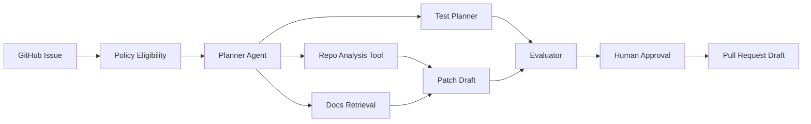

# Visual Product Blueprint

AegisOps must be visual-heavy enough for a non-technical executive and inspectable enough for
a principal engineer.

## Main Navigation

| Section | Purpose |
| --- | --- |
| Portfolio | Enterprise workflow library |
| Command Center | Active workflow run and executive summary |
| Agent Graph | Interactive LangGraph execution graph |
| Evidence Board | Real sources, logs, documents, citations, API results |
| Policy Studio | OPA decisions, approval rules, tool permissions |
| Tool Registry | MCP tools, schemas, scopes, risk classes |
| Memory Explorer | Thread memory, long-term facts, retention metadata |
| Trace Timeline | Model calls, tool calls, retries, approvals, costs |
| Eval Dashboard | Regression, safety, grounding, and quality checks |
| Deployment Panel | Health, env vars, CI, migrations, connector status |
| Code Lens | Graph code, schemas, configs, policies, tests |

## Peel-The-Layers Interaction

Every visual node should support three depth levels:

| Level | Audience | Contents |
| --- | --- | --- |
| Executive | CEO | Outcome, risk, cost, confidence, next action |
| Architect | CTO | Graph node, policy, tool, memory, trace |
| Engineer | Developer | Schema, payload, source file, test, deployment config |

## Node Inspection Contract

Clicking any graph node must show:

- Node purpose.
- Inputs and outputs.
- Model used, if any.
- Tool schemas, if any.
- Policy decision.
- Guardrail result.
- Memory reads/writes.
- Trace ID.
- Cost and latency.
- Evidence sources.
- Approval status.

## Visual Run Example

## Design Constraints

- The first screen is the product, not a landing page.
- Use dense, scannable dashboards instead of marketing sections.
- Use real visual artifacts: graphs, timelines, tables, code panes, diffs, traces.
- Avoid decorative visuals that do not explain the system.
- No in-app tutorial prose explaining obvious UI mechanics.
- Text must fit on mobile and desktop.
