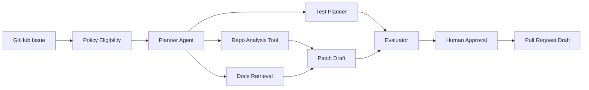

# Visual Product Blueprint

AegisOps must be visual-heavy enough for a non-technical executive and inspectable enough for
a principal engineer.

## Main Experience

The first screen must be the workflow cockpit, not a documentation dashboard. The user should
select one of four to five enterprise use cases, press a real run-start control, and see a
shared step-by-step graph that is backed by live workflow contracts, live runtime gates, or
persisted real trace records. When the full runtime is not configured, the UI must show the
exact blocked gate instead of rendering fabricated tool calls, evidence, model reasoning, or
memory.

The default visualization must be a story-first comparison. Every stage must expose its real input,
the controller, the observable decision or fixed condition, and its output. It must also state in
plain language what can adapt in the agentic lane and what was preconfigured in the deterministic
lane. Show the traditional rule-based path for the same use case immediately after the agent lane,
then compare both outputs and state why the agentic implementation is justified for that scenario.

Keep the interactive topology as a separate architect lens. Do not shrink an entire graph until its
nodes become unreadable: use full-size nodes with pan, zoom, and active-edge animation. On mobile,
render the story as full-width vertical stages and keep the topology pannable.

## Navigation And Lenses

| Section                   | Purpose                                                           |
| ------------------------- | ----------------------------------------------------------------- |
| Portfolio                 | Enterprise workflow library                                       |
| Command Center            | Active workflow run and executive summary                         |
| Autonomy Taxonomy         | Fixed rules vs dynamic policy vs AI workflow vs agentic execution |
| Multi-Agent Orchestration | Supervisor-worker coordination, handoffs, evidence reconciliation |
| Agent Graph               | Interactive LangGraph execution graph                             |
| Evidence Board            | Real sources, logs, documents, citations, API results             |
| Policy Studio             | OPA decisions, approval rules, tool permissions                   |
| Tool Registry             | MCP tools, schemas, scopes, risk classes                          |
| Memory Explorer           | Thread memory, long-term facts, retention metadata                |
| Trace Timeline            | Model calls, tool calls, retries, approvals, costs                |
| Eval Dashboard            | Regression, safety, grounding, and quality checks                 |
| Deployment Panel          | Health, env vars, CI, migrations, connector status                |
| Code Lens                 | Graph code, schemas, configs, policies, tests                     |

## Autonomy Taxonomy

The portal must not imply that every automated step is agentic. It should show four separate
execution modes:

| Mode           | Use For                                               | Production Controls                         |
| -------------- | ----------------------------------------------------- | ------------------------------------------- |
| Fixed rules    | Stable validation, readiness, schema, and state gates | Typed schemas, tests, deterministic checks  |
| Dynamic policy | Contextual allow/block/approval decisions             | OPA/Rego, policy fixtures, audit decisions  |
| AI workflow    | Bounded model transforms and structured evaluations   | Structured outputs, model ledger, evals     |
| Agentic        | Stateful planning, tool use, adaptation, handoffs     | LangGraph, MCP, checkpoints, human review   |

Every workflow view should show which parts are deterministic, which parts are policy-driven,
which parts call a model, and which parts are truly agentic.

## Peel-The-Layers Interaction

Every visual node should support three depth levels:

| Level     | Audience  | Contents                                              |
| --------- | --------- | ----------------------------------------------------- |
| Executive | CEO       | Outcome, risk, cost, confidence, next action          |
| Architect | CTO       | Graph node, policy, tool, memory, trace               |
| Engineer  | Developer | Schema, payload, source file, test, deployment config |

## Node Inspection Contract

Clicking any graph node must show:

- Node purpose.
- Inputs and outputs.
- Model used, if any.
- Tool schemas, if any.
- Policy decision.
- Guardrail result.
- Memory reads/writes.
- Trace ID.
- Cost and latency.
- Evidence sources.
- Approval status.

## Visual Run Example

## Design Constraints

- The first screen is the product, not a landing page.
- Use dense, scannable dashboards instead of marketing sections.
- Use real visual artifacts: graphs, timelines, tables, code panes, diffs, traces.
- Avoid decorative visuals that do not explain the system.
- No in-app tutorial prose explaining obvious UI mechanics.
- Text must fit on mobile and desktop.
