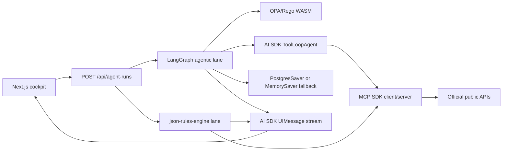
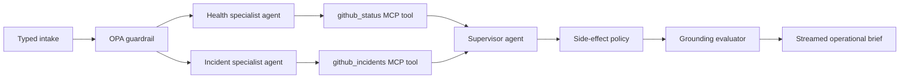

# Live Workbench Runtime

Status: implemented and locally verified on 2026-07-17.

## Product Contract

The first viewport is an execution cockpit. A user selects an enterprise scenario, adjusts bounded
inputs and controls, and starts two systems against the same live source data:

1. The agentic lane can plan, select typed tools, adapt to results, reconcile evidence, pass policy,
   and evaluate grounding.
2. The fixed-rule lane fetches predefined fields, evaluates versioned conditions, and returns only
   outcomes that were configured before the run.

This comparison is executable, not explanatory copy. The UI receives a streamed event contract and
maps each event to a React Flow node, animated edge, trace row, evidence record, policy state, and
unit-economics metric.

## Runtime Topology



## Multi-Agent Incident Graph

Multi-agent orchestration is used only for incident investigation because two independent evidence
surfaces can be collected in parallel and reconciled before an operational decision.



Each specialist is a separate AI SDK `ToolLoopAgent` with one active tool, a separate model ledger,
and a scoped assignment. LangGraph executes both specialist nodes in the same superstep, waits at a
fan-in barrier, and sends both structured reports to a third supervisor agent. The supervisor has no
tools and cannot silently fetch new evidence during reconciliation.

## Live Scenario Library

| Scenario | Official source | Agent tools | Fixed-rule examples |
| --- | --- | --- | --- |
| Incident response | GitHub Status API | `github_status`, `github_incidents` | unresolved count, degraded component count |
| Engineering triage | GitHub REST API | `github_issue`, `github_repository` | comment count, labels, archive state |
| Supplier risk | GLEIF LEI API | `gleif_entity` | match count, entity and registration status |
| Finance evidence | SEC EDGAR Data API | `sec_company_facts` | observation presence and filing age |

All source responses are parsed with Zod before they become evidence or rule facts. Business
routing is owned by `json-rules-engine` or OPA, never regular expressions.

## Governance

- Public tools are read-only and allowlisted in `policies/aegisops/public_demo.rego`.
- Maximum tool calls and maximum spend are part of the typed request and OPA input.
- Any write or external message returns `allow=false` and `require_approval=true`.
- The grounding evaluator rejects an agent run unless every scenario-required source produced a
  validated evidence record.
- The public route is rate limited and returns explicit blocked reasons.
- Tool arguments, result fields, evidence URLs, model tokens, latency, trace ID, and policy controls
  are visible in the run inspector.

## State And Production Tradeoffs

`DATABASE_URL` activates `@langchain/langgraph-checkpoint-postgres` in the `aegisops_demo` schema.
Without it, the free public deployment uses `MemorySaver`; that mode is suitable for one request's
graph state but is not durable across serverless instances. The UI therefore says `Postgres-ready`
instead of claiming durable storage.

The current in-process rate limiter is a spend safety fallback. Production traffic requires a
shared Upstash/Redis limiter so limits survive instance changes. External write tools remain absent
until authenticated identities, durable approval records, audit persistence, and four-eyes policy
are configured.

## Unit Economics

The provider charge and architecture comparison are separate metrics:

- GitHub Models free-tier charge: `$0.0000` for the public demo, subject to provider rate limits.
- Direct OpenAI API equivalent: calculated from measured input/output tokens and the selected
  model's published token rates.
- Deterministic lane model cost: `$0.0000`; it makes no model call.

The spend ceiling is a policy limit, not a claim about actual charge.

## Environment

| Variable | Required | Behavior |
| --- | --- | --- |
| `GITHUB_MODELS_TOKEN` | Recommended for free demo | Uses GitHub Models OpenAI-compatible inference |
| `OPENAI_API_KEY` | Optional | Uses direct OpenAI provider when GitHub Models is absent |
| `VERCEL_OIDC_TOKEN` | Optional | Enables Vercel AI Gateway fallback |
| `DATABASE_URL` | Optional, production recommended | Enables durable LangGraph Postgres checkpoints |

Never expose these values to browser code or commit them to the repository.

## Verification

```bash
pnpm --filter @aegisops/web typecheck
pnpm --filter @aegisops/web lint
pnpm --filter @aegisops/web test
pnpm --filter @aegisops/web build
```

Browser acceptance requires one completed incident run, two specialist tool calls, two validated
evidence records, a supervisor handoff, OPA side-effect blocking, a passing grounding evaluator,
completed deterministic rules, and no horizontal overflow at 390 px.
