# Observability and Evals

An agentic platform is not production-ready unless runs are observable, testable, and
regression-checked.

## Observability Layers

| Layer | What To Capture |
| --- | --- |
| API | Request ID, user, workflow, latency, errors |
| Graph | Node start/end, state changes, branch decisions |
| Model | Model, prompt version, tokens, latency, structured output |
| Tools | Tool name, schema, input hash, output metadata, auth scope |
| Policy | Decision, rule package, input metadata, explanation |
| Memory | Reads, writes, retention class, source |
| Retrieval | Query, sources, scores, citations |
| Approval | Request, approver, decision, timestamp |
| Cost | Estimated and actual token/tool cost |
| Eval | Test case, score, rubric, pass/fail |

## Trace Timeline

```mermaid
gantt
  title Agent Run Timeline
  dateFormat X
  axisFormat %s
  section Run
  Start: 0, 1
  Policy Eligibility: 1, 2
  Planning: 2, 5
  Tool Calls: 5, 10
  Evaluation: 10, 13
  Approval: 13, 17
  Final Action: 17, 19
```

## Evaluation Types

| Eval Type | Purpose |
| --- | --- |
| Schema eval | Output conforms to contract |
| Grounding eval | Claims are supported by evidence |
| Safety eval | Sensitive data and risky actions controlled |
| Tool eval | Tool calls are appropriate and valid |
| Cost eval | Run stays inside budget |
| Regression eval | Behavior remains stable across changes |
| Human review eval | Approval paths and final artifacts are acceptable |

## CI Expectations

The repository should eventually enforce:

- Unit tests for policy and schemas.
- Graph tests for branch behavior.
- Tool-contract tests.
- Prompt and model regression tests.
- RAG grounding tests.
- Red-team prompt injection tests.
- End-to-end workflow smoke tests against sandbox real systems.
